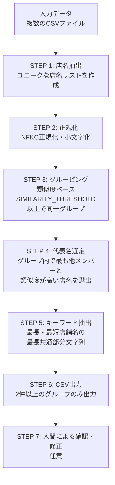

# 店名グルーピングマスタ生成マニュアル（通常版）

## 概要

店名の表記ゆれを吸収し、同一店舗をグループ化するためのマスタを生成するツールです。
**類似度ベース**でグルーピングを行います。

## 対象

- 小〜中規模データ（数千件程度）
- 精度重視の場合

## 処理フロー図



## 実行方法

```python
from group_merchants import main
main()
```

## 設定値

```python
# 類似度の閾値（0.0〜1.0）
# - 店名同士を比較して、この値以上の類似度であれば同じグループとみなす
# - 例: 0.8 = 80%以上一致で同一グループ
# - 高くすると厳密（グループが細かくなる）、低くすると緩やか（グループが大きくなる）
SIMILARITY_THRESHOLD = 0.8
```

## 出力ファイル

`output/merchant_grouping_master.csv`

| カラム | 説明 |
|--------|------|
| keyword | 部分一致用キーワード（正規化済み） |
| merchant_name | 元の店名 |

## 出力例

```csv
keyword,merchant_name
せぶんいれぶん,セブン-イレブン 渋谷店
せぶんいれぶん,セブンイレブン新宿店
ふぁみりーまーと,ファミリーマート千代田店
```

---

## マスタの修正（手動）

出力されたCSVをExcelなどで開き、必要に応じて修正します。

### 修正作業

1. **キーワードの統一**: 同じグループにしたい店名は同じキーワードに変更
2. **キーワードの分割**: 誤ってまとめられた店名は別のキーワードに変更
3. **不要行の削除**: マスタに含めたくない店名は行ごと削除

---

## 注意事項

- キーワードは**正規化済み**（小文字、全角→半角など）の状態で保存されます
- 自動グルーピングの精度は100%ではないため、必要に応じて人間が確認・修正してください
- 大規模データ（数万件以上）の場合は高速版（`MANUAL_FAST.md`）を参照してください
