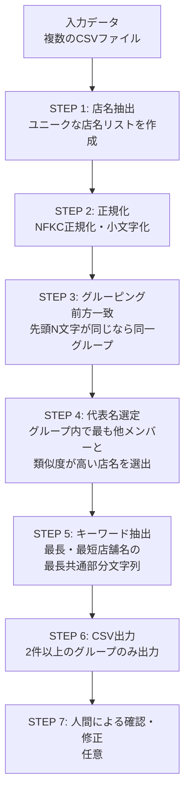

# 店名グルーピングマスタ生成マニュアル（高速版）

## 概要

店名の表記ゆれを吸収し、同一店舗をグループ化するためのマスタを生成するツールです。
**前方一致**でグルーピングを行い、大規模データに対応しています。

## 対象

- 大規模データ（数万件以上）
- 速度重視の場合

## 処理フロー図



## 実行方法

```python
from group_merchants_fast import main
main()
```

## 設定値

```python
# 前方一致の文字数
# - 正規化後の先頭N文字が同じなら同一グループとみなす
# - 小さいと誤グループ化が増える、大きいと類似店名を見逃す
PREFIX_LENGTH = 3
```

## 出力ファイル

`output/merchant_grouping_master.csv`

| カラム | 説明 |
|--------|------|
| keyword | 部分一致用キーワード（正規化済み） |
| merchant_name | 元の店名 |

## 出力例

```csv
keyword,merchant_name
せぶんいれぶん,セブン-イレブン 渋谷店
せぶんいれぶん,セブンイレブン新宿店
ふぁみりーまーと,ファミリーマート千代田店
```

---

## 通常版との違い

| 項目 | 通常版 | 高速版 |
|------|--------|--------|
| グルーピング方式 | 類似度ベース | 前方一致 |
| 計算量 | O(n²) | O(n) |
| 対象データ規模 | 数千件 | 数万件以上 |
| 精度 | 高い | やや低い |

### 高速版の注意点

前方一致方式のため、以下のケースは別グループになります：

```
「セブンイレブン渋谷店」→ 先頭3文字: 「せぶん」
「アセブンイレブン茨城店」→ 先頭3文字: 「あせぶ」
→ 別グループ（人間が修正する必要あり）
```

---

## マスタの修正（手動）

出力されたCSVをExcelなどで開き、必要に応じて修正します。

### 修正作業

1. **キーワードの統一**: 同じグループにしたい店名は同じキーワードに変更
2. **キーワードの分割**: 誤ってまとめられた店名は別のキーワードに変更
3. **不要行の削除**: マスタに含めたくない店名は行ごと削除

---

## 注意事項

- キーワードは**正規化済み**（小文字、全角→半角など）の状態で保存されます
- 自動グルーピングの精度は100%ではないため、必要に応じて人間が確認・修正してください
- 高速版は前方一致のため、通常版より誤グループ化が多くなる可能性があります
